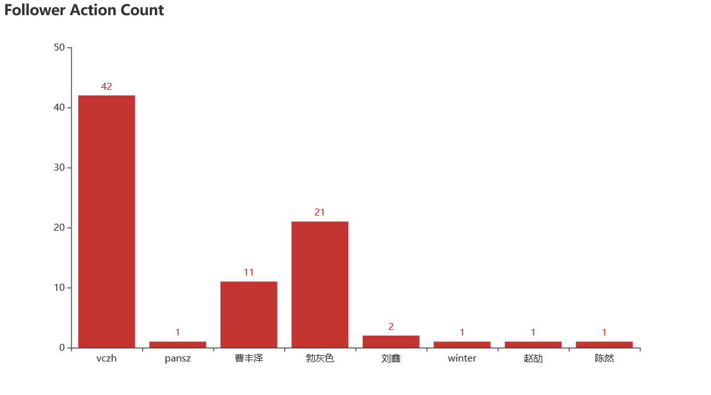
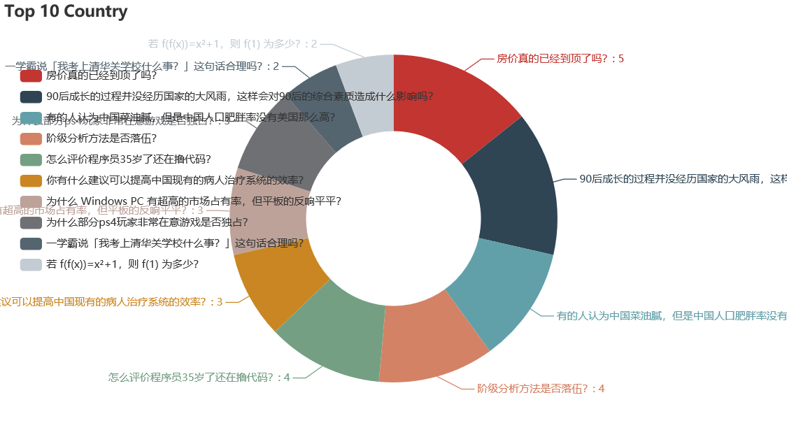

# Selenium + 无头浏览器爬知乎

## 操作演示

- 爬取知乎关注的用户 两天内 的动态并将爬虫数据可视化输出
  

- 数据输出一：用户动态分布图
  

- 数据输出二：近期前十大动态最多的问题
  

## 功能

- 创建 Feed 类，用于存放爬虫数据, 方便后续代码高效利用
- 自动爬取异步加载的内容
- 浏览器翻页、下拉行为模拟，爬取动态页面
- 利用真实 cookie 通过身份验证, 爬取保护内容
- 利用 pyecharts 对爬虫数据进行可视化处理

## 使用方法

- 模拟浏览器行为爬知乎: 
  - 创建 serect.py 于根目录, 在浏览器中复制个人知乎账号的cookie，存放入 serect.py
    - 格式为: cookie = 'k=v;k=v;...'
    - cookie 需要去掉 _xsrf _zap tgw_l7_route 这三项
  - 执行 zhihu_bycookie.py 或zhihu_bybrowser.py
  - 无头浏览器模式可将 **# o.add_argument("--headless")** 取消注释再执行
  - 运行结束后自动生成 zhihu.html; zhihu_bars.html; zhihu_radius.html 